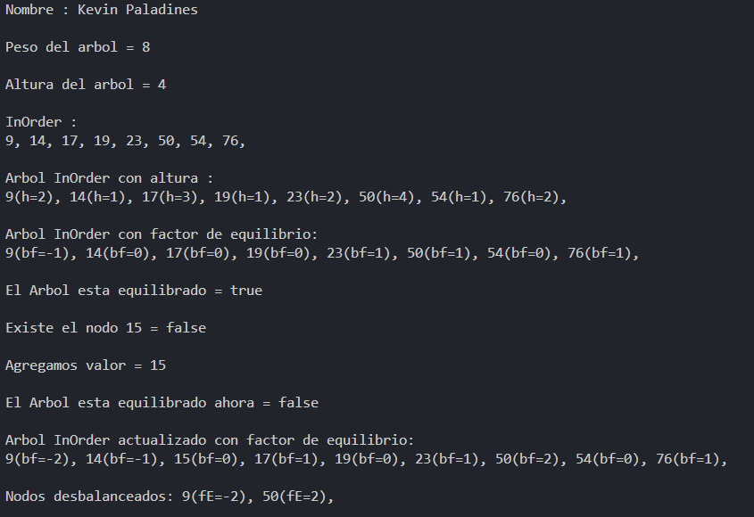

# Estructuras No lineales

## 📌 Información General

- **Título:** Estructuras No lineales
- **Asignatura:** Estructura de Datos
- **Carrera:** Computación
- **Estudiante:** Kevin Paladines
- **Fecha:** 19/06/2025
- **Profesor:** Ing. Pablo Torres

---

## 🧩 Estructura del proyecto
    src/
    │
    ├── Materia
    │   └── Controllers
    │        └── BinaryTree
    │   └── Models
    │        └── Node
    │
    └── App.java

    ---

---
## 🧑‍💻 Ejemplo de Entrada y Salida

